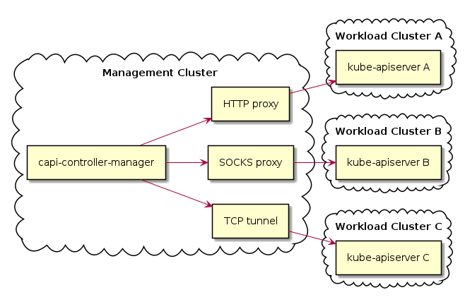

# Custom workload cluster kubeconfigs

## Table of Contents

* [Custom workload cluster kubeconfigs](#custom-workload-cluster-kubeconfigs)
  * [Table of Contents](#table-of-contents)
  * [Glossary](#glossary)
  * [Summary](#summary)
  * [Motivation](#motivation)
    * [Goals](#goals)
    * [Non\-Goals](#non-goals)
    * [Future Work](#future-work)
  * [Proposal](#proposal)
  * [User Stories](#user-stories)

## Glossary

- Kubeconfig
- Management Cluster
- Workload Cluster
- Proxy
- Tunnel
- Infrastructure Provider
- Cluster API Controllers
- API Server

## Summary

This proposal describes how to allow the Cluster API Controllers to reach Workload Cluster API servers that are not reachable directly, but are instead reachable through a proxy or tunnel.

It introduces a new controller--the Kubeconfig Provider--that generates kubeconfigs that contain information necessary to reach the Workload Cluster API server through a proxy or tunnel.

This change will enable a Management Cluster to run in a restricted network environment, and to manage Workload Clusters in restricted network environments.

## Motivation

As of v1alpha2, cluster API controllers [must be able to reach the workload cluster API](https://github.com/kubernetes-sigs/cluster-api/blob/cbb820d/docs/proposals/20190610-machine-states-preboot-bootstrapping.md#machine-controller-can-access-any-machine-or-cluster-in-any-namespace). A kubeconfig gives the controllers all the information needed to reach the API server and authenticate with it. An infrastructure provider generates a kubeconfig for each workload cluster.

Some workload clusters may have an API server that cannot be reached by the Cluster API controllers. One example is a workload cluster whose API server is [accessible only from a network that disallows ingress from the internet](https://github.com/kubernetes-sigs/cluster-api-provider-aws/issues/873). Another example is a workload cluster whose API server is [accessible only through a proxy](https://github.com/kubernetes/client-go/issues/351).

### Goals

- To generate a kubeconfig that enables the Cluster API controllers to reach the Workload Cluster through an HTTP/S proxy, a SOCKS proxy, or TCP tunnel.

### Non-Goals

- To generate kubeconfigs for any purpose other than use by Cluster API controllers.
- To configure a Workload Cluster API Server to accept requests arriving through a proxy or tunnel. For example, to add the TCP tunnel IP or DNS name to the Subject Alt Names of the Workload Cluster's API Server X509 certificate.
- To configure the proxy or tunnel.

## Proposal

Generate a kubeconfig that enables the Cluster API controllers to reach the Workload Cluster through an HTTP/S proxy, a SOCKS proxy, or TCP tunnel.

<!-- This is where we get down to the nitty gritty of what the proposal actually is. -->

### User Stories [optional]

#### As a Kubernetes operator, I'd like to deploy a workload cluster in a restricted network, where the API server is not reachable directly from the internet.

#### As a Kubernetes operator, I'd like to run a workload cluster in a restricted network, where HTTP/S requests can reach the internet only through a proxy.

### Implementation Details/Notes/Constraints [optional]

Kubeconfig support for HTTP/S and SOCKS proxies is a [long-standing feature request](https://github.com/kubernetes/client-go/issues/351). An implementation appears complete, but has yet to be merged; this proposal can be implemented only after it is merged.

<!-- What are the caveats to the implementation?
What are some important details that didn't come across above.
Go in to as much detail as necessary here.
This might be a good place to talk about core concepts and how they releate. -->

### Risks and Mitigations

<!-- What are the risks of this proposal and how do we mitigate.
Think broadly.
For example, consider both security and how this will impact the larger kubernetes ecosystem.

How will security be reviewed and by whom?
How will UX be reviewed and by whom?

Consider including folks that also work outside the SIG or subproject. -->

## Design Details

### Test Plan
TODO @release

### Graduation Criteria
TODO @release

### Upgrade / Downgrade Strategy
TODO @release

### Version Skew Strategy
TODO @release

## Implementation History

<!-- Major milestones in the life cycle of a proposal should be tracked in `Implementation History`.
Major milestones might include

- the `Summary` and `Motivation` sections being merged signaling acceptance
- the `Proposal` section being merged signaling agreement on a proposed design
- the date implementation started
- the first Kubernetes release where an initial version of the proposal was available
- the version of Kubernetes where the proposal graduated to general availability
- when the proposal was retired or superseded -->

## Alternatives

### Infrastructure Provider Creates Custom Kubeconfigs

Although an Infrastructure Provider generates a kubeconfig for each Workload Cluster, the Infrastructure Provider may not know that the Workload Cluster's API server can be reached only through a proxy or tunnel. There are many ways to configure a proxy or tunnel, and supporting them all is not the responsibility of the Infrastructure Provider.

### Shared Controller Creates Custom Kubeconfigs

Cluster API implements many shared controllers, e.g., the MachineSet controller. A shared controller to generate custom kubeconfigs would have to support the many ways to configure a proxy or tunnel. Support for any new configuration would have to be merged upstream and would be available only with the next CAPI release.